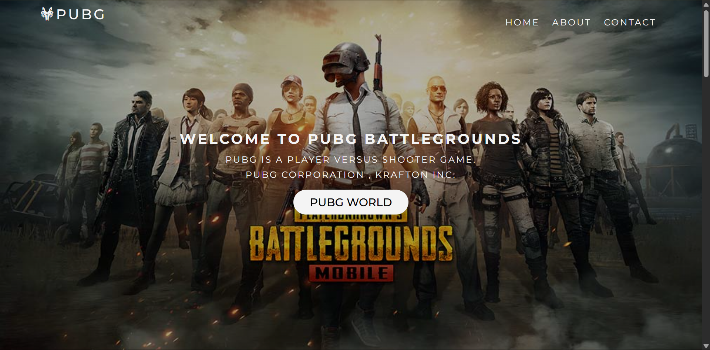
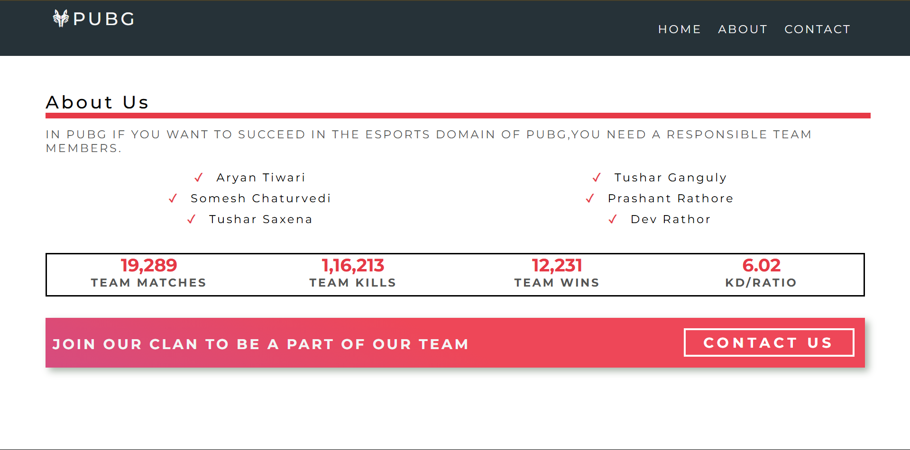
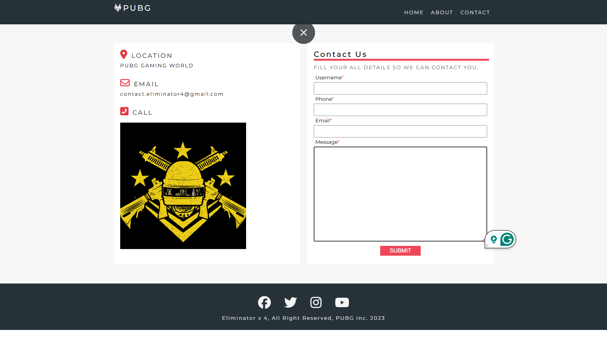

# PUBG with E4x 🎮🔥

Welcome to **PUBG with E4x** – a simple yet sharp static web structure made especially for **BGMI/PUBG clans** and **esports teams**. 
Whether you're building a squad, showing off your roles, or getting players to contact you, this mini-site setup is all you need to get started.

## 📸 Project Preview

> Note: You might have to compromise with this quality, but trust me dude, it's really a cool thing.

---

## 📷 Screenshots

<!-- Home Page - left and more considerable (around 69%) -->

  

<!-- About Us & Contact Us - side by side -->
<table>
  <tr>
    <td>
       
      <strong>About Us</strong>
    </td>
    <td>
       
      <strong>Contact Us</strong>
    </td>
  </tr>
</table>

---

## 🧱 Project Structure

This project uses basic **HTML5** and **CSS3**, with Font Awesome for icons. 
No frameworks, no BS. Just raw, clean front-end to keep things lightweight and easy to customise.

---

## 💡 Features

- 🏠 **Home Page**:
  - Introduces team roles like Assaulter, Sniper, Supporter, and Camper.
  - Scrollable sections with call-to-action.

- 📊 **About Page**:
  - Highlights squad members.
  - Shows stats like Matches Played, Team Kills, Wins, and KD Ratio.
  - CTA Banner for joining the clan.

- 📬 **Contact Page**:
  - Simple contact form for player inquiries.
  - Includes location, email, and a placeholder for phone number.
  - Social media footer icons (Facebook, Twitter, Insta, YouTube).

---

## 🚀 How to Use

1. Clone or download the repo.
2. Add your team’s logo, images, and replace dummy data (names, stats, contact).
3. Open any `.html` file directly in a browser – no server needed.
4. Optionally host it on GitHub Pages or Netlify for free!

---

## 📩 Contact

For any collabs or improvements, drop a message at:  
**📧 feedback.glimpsesofindiaa@gmail.com**

---

## 👑 Credits

Made with 💻 by **Aryaman Raj Tiwari** and team **E4x** – Just for fun and love of PUBG Mobile (Now BGMI).

---

